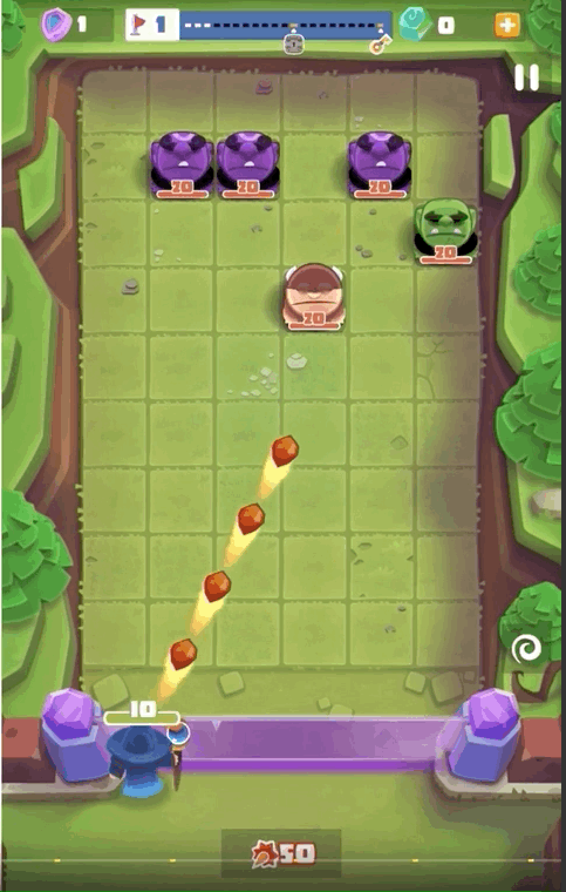

# *Wanted: Point and Shot (provisional)*
Título
: Documento de diseño de juego - *Wanted: Point and Shot (provisional)*

Autores
: Díaz Pérez, Diego
: Laso Cáceres, Juan Carlos
: Mena Molina, Guillermo
: Rodríguez Corpas, Laura
: Rodríguez Martínez, Francisco Javier

## 1. Concepto
   + **Título**:  *Wanted: Point and Shot (provisional)*.
   + **Estudio**: *Castle's Games*.
   + **Género**: Arcade.
   + **Arte**: 3D con estilo *cartoon*.
   + **Plataforma**: Smartphone y PC (Web Version)*.
   + **Versión:** 1.0.
   + **Sinopsis de jugabilidad y contenido**: *Wanted: Point and Shot (provisional)* es un juego arcade basado en progresión de niveles con una ambientación western donde el protagonista tiene que derrotar a los enemigos disparando su arma.
   + **Categoría**: *XXX* se puede comparar con el videojuego *Bounzy*, ya que tiene las mismas mecánicas. El valor diferenciador del juego es la temática Western. 
   + **Licencia**: *XXX* es totalmente original y no está basado en ningún libro o película. 
   + **Mecánica**: El protagonista utiliza su arma para disparar balas que rebotarán entre los enemigos mediante un sistema de físicas. Cada vez que una bala toque a un enemigo éste perderá un porcentaje de salud.
   + **Tecnología**: El juego será desarrollado íntegramente en **Unity**.  En cuanto al arte del videojuego, se utilizará el programa ***Adobe Photoshop CC 2018*** del paquete *Adobe*. Para el modelado en 3D se utilizarán ***Maya*** y ***3DS Max***.
   + **Público**: El público objetivo está entre el rango de edades de 16 a 30 años. Entre ellos, jugadores masculinos que disfruten la ambientación western y prefieran partidas rápidas o no tengan demasiado tiempo para dedicarle al juego.

## 2. Historial de versiones
| Versión 	| Fecha 	 | Comentarios|
|:---------:|:----------:|------------|
| 0.0 		| 19/11/2018 | Planteamiento del juego y construcción inicial del Documento de Diseño de Juego (*Game Document Design - G.D.D.*)|
| 0.1		| 30/11/2018 | Se definen *mecánicas*, *arte del juego*, *estructuración de niveles* |
| 1.0 		| 05/12/2018 | Se completa la primera versión del *G.D.D.* de *XXX*|

## 3. Visión general del videojuego
*Wanted: Point and Shot (provisional)* es un videojuego de género Arcade Free to Play en el que combina la fase de acción de Bounzy y una temática Western low poly, novedosa para este género. 

El jugador encarna al Sherif del condado cuya misión es acabar con la delincuencia, en cada nivel el jugador se encontrará con distintos enemigos y un boss final. El juego se basa en una progresión de niveles procedural en los que se aumenta la dificultad.

La fase de acción se basa en un sistema de turnos y una mecánica de disparo, en la que el jugador apunta hacia una parte de la pantalla y dispara una serie de elementos (balas) que rebotan en el escenario a través de un sistema de físicas, estos elementos infringen daño a los enemigos del tablero y dichos enemigos caen una posición en el tablero cada turno, cuando llegan al personaje del jugador le infringen daño.

 - Fase de acción - Bounzy
 

## 4. Mecánicas
   + **Cámara:** Videojuego en 3D con una cámara estática. Plano *top-down*. El jugador puede ver en todo momento todos los elementos del nivel.
   + **Controles:** En PC el jugador apunta moviendo el cursor del ratón y dispara haciendo *clic*. En *Smartphone* se apunta manteniendo el dedo pulsado en la dirección hacia la que quieres disparar y disparas levantando el dedo de la pantalla.
   + **Puntuación:** La puntuación final que haya obtenido el jugador es el número de nivel al que haya llegado.
   + **Guardar/Cargar:** El progreso del jugador se guardará automáticamente. Al iniciar el juego seguirás en el nivel en el que acabaras la última vez.
   + **Niveles**: El número de niveles será infinito y se generarán de forma procedural, el jugador puede avanzar niveles continuamente. Cada nivel se divide en un número de enemigos y un boss final.

## 5. Estados del juego
A continuación se presenta el diagrama de estados del juego sobre las posibles pantallas de la interfaz en las que el jugador se puede encontrar:

> Diferentes estados del juego

Estos estados se describen más detenidamente en el apartado siguiente - ***6. Interfaces***

## 6. Interfaces
   + **Menú principal**: Es la pantalla inicial que se encuentra el jugador al iniciar el juego. El jugador podrá localizar en ella dos botones con los que tendrá la opción de abrir el menú de opciones y de iniciar una partida. Estos botones se disponen alineados verticalmente uno encima de otro con una separación entre ellos. No hay *background*, en su defecto se enseña el propio escenario en el que se jugará la partida.
      + Estados del juego: 
	      + Hacia el **menú de opciones** pulsando en el botón *Opciones*.
	      + Hacia la **pantalla de juego** pulsando en el botón *Play*.
   + **Menú de opciones**: Pantalla en la cual el jugador puede eligir el *idioma* del juego (Castellano o Inglés) y habilitar/deshabilitar la *música y sonido*. Además, en esta pantalla se podrán ver los créditos del juego. La pantalla dispondrá de un botón para volver al *menú principal*.
      + Estados del juego: 
	      + Hacia el **menú principal** pulsando en el botón con una flecha la cual indica *volver a la pantalla anterior*.
   + **Pantallas de juego /** ***Heads-up Display***: pantalla que muestra toda la información necesaria al jugador durante la partida. Se distribuyen de la siguiente manera:
	   + PC: 
			+ El jugador siempre aparecerá en la parte inferior de la pantalla, dejando el resto de la pantalla para ver a los enemigos.
		   + La barra de vida del jugador se colocará en la esquina inferior izquierda de la pantalla y en color verde.
		   + El número de nivel en el que se encuentra el jugador aparecerá en la esquina superior izquierda.
		   + En la esquina superior derecha se le mostrará un botón de pausa al jugador para que pueda pausar la partida en cualquier momento. Esta acción también podrá llevarse a cabo pulsando la tecla *p* en el teclado en el caso de *PC*.
	   + Estados del juego:
		   +  Hacia el **menú de pausa** pulsando sobre el botón de pausa situado en la esquina superior derecha.
   + **Pantalla de pausa**: Pantalla donde el jugador puede parar el estado de la partida, durante el tiempo que quiera. Esta pantalla dispondrá de dos botones para volver al menú principal o bien reanudar la partida. Estos botones se encuentran centrados en pantalla y alineados verticalmente uno del otro. 
      + Estados del juego: 
	      + Hacia el **menú principal** pulsando en el botón *Menú principal*.
	      + Hacia la **pantalla de juego** pulsando en el botón *Volver al juego*.
   + **Pantalla fin del juego / puntuación**: Pantalla donde se le muestra la puntuación obtenida al finalizar el juego. Consta de la información y un sólo botón para volver al menú principal, ya sea para comenzar una partida nueva o salir del juego.
      + Estados del juego:
	      + Hacia el **menú principal** pulsando en el botón *Menú principal*.
      
## 7. Niveles
El juego consta de **tres niveles** en los cuales la dificultad de los enemigos irá aumentando para el jugador. 

Cada nivel consta de **cinco salas** y la estructura de cada nivel será de una primera sala fija, tres salas aleatorias y la sala final con el *Enemy Boss* correspondiente a ese nivel. ***El jugador no podrá volver hacia una sala anterior o nivel anterior en ningún momento***.

En las tres salas aleatorias el jugador se podrá encontrar diferentes sucesos los cuales aparecerán de forma totalmente aleatoria en cada partida. :
+ Un **enemigo**: da lugar a un combate.
+ Un **cofre**: el jugador puede obtener nuevas cartas o *items* con los que equiparse.
+ Un **evento aleatorio**:
+ Una **enfermería**: el jugador recupera sus puntos de vida perdidos en combates anteriores.  

El jugador deberá atravesar todas las salas para avanzar al siguiente nivel. Una vez el jugador derrote al enemigo final del nivel podrá avanzar al siguiente nivel de la partida.

A continuación se describe con más detalle los tres niveles del juego:

+ ***Nivel 1*** **- Entrada**
	+ **Entrada**:  primer nivel del juego y el más sencillo. Este nivel consta de cinco salas. La 1ª Sala será un combate contra un enemigo básico, que nos servirá también como tutorial para aprender las mecánicas básicas del juego. Luego encontraremos tres salas más donde se darán los diferentes sucesos descritos anteriormente. Por último, una sala final con el *Enemy Boss* de este nivel. Una vez derrotado se abrirá la opción de elegir entre **tres caminos** para avanzar.
		+ *Objetivos*: el jugador deberá atravesar todas las salas para avanzar al siguiente nivel. Una vez el jugador derrote al enemigo final del nivel podrá avanzar al siguiente nivel de la partida.
		+ *Enemigos*: Goblin, HomoGoblin.
		+ *Música y efectos de sonido*: 
 + ***Nivel 2*** **- Torreón / Jardines / Mazmorras**
	 + **Torreón**: segundo nivel del juego con una dificultad intermedia. Este nivel consta de cinco salas. La 1ª Sala será una sala con cofre para recompensar al jugador por haber derrotado al *Enemy Boss* del nivel anterior. En esta sala también nos curaremos la vida por completo. Luego encontraremos tres salas más donde se darán los diferentes sucesos descritos anteriormente. Por último, una sala final con el *Enemy Boss* de este nivel. Una vez derrotado podremos avanzar hacia la **Torre de Magia**.
		+ *Objetivos*: el jugador deberá atravesar todas las salas para avanzar al siguiente nivel. Una vez el jugador derrote al enemigo final del nivel podrá avanzar al siguiente nivel de la partida.
		+ *Enemigos*: Aprendiz de mago, Mago corrupto.
		+ *Música y efectos de sonido*: 
	 + **Jardines**: segundo nivel del juego con una dificultad intermedia. Este nivel consta de cinco salas. La 1ª Sala será una sala con cofre para recompensar al jugador por haber derrotado al *Enemy Boss* del nivel anterior. En esta sala también nos curaremos la vida por completo. Luego encontraremos tres salas más donde se darán los diferentes sucesos descritos anteriormente. Por último, una sala final con el *Enemy Boss* de este nivel. Una vez derrotado podremos avanzar hacia el **Salón de fiestas**.
		+ *Objetivos*: el jugador deberá atravesar todas las salas para avanzar al siguiente nivel. Una vez el jugador derrote al enemigo final del nivel podrá avanzar al siguiente nivel de la partida.
		+ *Enemigos*: Aprendiz de mago, Mago corrupto.
		+ *Música y efectos de sonido*: 
	 + **Mazmorras**: segundo nivel del juego con una dificultad intermedia. Este nivel consta de cinco salas. La 1ª Sala será una sala con cofre para recompensar al jugador por haber derrotado al *Enemy Boss* del nivel anterior. En esta sala también nos curaremos la vida por completo. Luego encontraremos tres salas más donde se darán los diferentes sucesos descritos anteriormente. Por último, una sala final con el *Enemy Boss* de este nivel. Una vez derrotado podremos avanzar hacia los **Aposentos de los guardias**.
		+ *Objetivos*: el jugador deberá atravesar todas las salas para avanzar al siguiente nivel. Una vez el jugador derrote al enemigo final del nivel podrá avanzar al siguiente nivel de la partida.
		+ *Enemigos*: Aprendiz de mago, Mago corrupto.
		+ *Música y efectos de sonido*: 
  + ***Nivel 3*** **- Torre de magia / Salón de fiestas / Aposentos de los guardias / Sala del Trono**
	 + **Torre de magia**: tercer nivel del juego con una dificultad alta. Este nivel consta de cinco salas. La 1ª Sala será una sala con cofre para recompensar al jugador por haber derrotado al *Enemy Boss* del nivel anterior. En esta sala también nos curaremos la vida por completo. Luego encontraremos tres salas más donde se darán los diferentes sucesos descritos anteriormente. Al superar la cuarta sala, accederemos a la **Sala del Trono** para enfrentarnos al *Boss* final del juego.
		+ *Objetivos*: el jugador deberá completar todas las salas del nivel para poder acceder a la Sala del Trono.
		+ *Enemigos*: Caballero oscuro.
		+ *Música y efectos de sonido*: 
	 + **Salón de fiestas**: tercer nivel del juego con una dificultad alta. Este nivel consta de cinco salas. La 1ª Sala será una sala con cofre para recompensar al jugador por haber derrotado al *Enemy Boss* del nivel anterior. En esta sala también nos curaremos la vida por completo. Luego encontraremos tres salas más donde se darán los diferentes sucesos descritos anteriormente. Al superar la cuarta sala, accederemos a la **Sala del Trono** para enfrentarnos al *Boss* final del juego.
		+ *Objetivos*: el jugador deberá completar todas las salas del nivel para poder acceder a la Sala del Trono.
		+ *Enemigos*: Caballero oscuro.
		+ *Música y efectos de sonido*: 
	 + **Aposentos de los guardias**: tercer nivel del juego con una dificultad alta. Este nivel consta de cinco salas. La 1ª Sala será una sala con cofre para recompensar al jugador por haber derrotado al *Enemy Boss* del nivel anterior. En esta sala también nos curaremos la vida por completo. Luego encontraremos tres salas más donde se darán los diferentes sucesos descritos anteriormente. Al superar la cuarta sala, accederemos a la **Sala del Trono** para enfrentarnos al *Boss* final del juego.
		+ *Objetivos*: el jugador deberá completar todas las salas del nivel para poder acceder a la Sala del Trono.
		+ *Enemigos*: Caballero oscuro.
		+ *Música y efectos de sonido*: 
	 + **Sala del trono**: último nivel del Juego, solo dispone de una sala. Esta es el combate más complicado de todo el juego ya que nos enfrentaremos al *Final Boss*.
		+ *Objetivos*: el jugador deberá derrotar al *Final Boss* del juego para poder ganar la partida.
		+ *Enemigos*: Rey maldito
		+ *Música y efectos de sonido*: 
## 8. Progreso del juego
En la siguiente ilustración se muestra el diagrama de progreso de juego:

> Diagrama progreso de juego

## 9. Personaje/s
   - **Personaje principal**:
	  + *Nombre*: se desconoce.
      + *Descripción*: Es el sheriff encargado de eliminar a los bandidos.
      + *Concepto*: El personaje será un varón adulto. Su vestimenta tendrá estilo cowboy.
      + *Encuentro*: El jugador se encontrará con este personaje al iniciar cada partida, y jugará siempre con él.
      + *Características*: El personaje solo tendrá una salud máxima.
      + *Jugable/No-Jugable*: Jugable.
 
## 10. Enemigos
A continuación se da una breve descripción de los personajes que sirven de enemigo para el jugador en el juego:
   - **Enemigo Verde**
      + *Nombre*: **Forajido**.
      + *Descripción*: Enemigos de color verde, son los más débiles del juego.
      + *Imagen*:
      + *Salud*: 5.
      + *Ataque*: 1.
   - **Enemigo Azul**
      + *Nombre*: **Forajido**.
      + *Descripción*: Enemigos de color azul, es 
      + *Imagen*:
      + *Salud*: 10.
      + *Ataque*: 3.
    
## Habilidades
El jugador dispondrá de una cantidad de **cartas** en la mano, las cuales podrá usar en los distintos combates contra los enemigos del castillo. El uso de las distintas cartas que posea el jugador durante un turno del combate se verá limitado por un **indicador de *maná***. Este indicador tiene, inicialmente, un máximo de *3 cupos* de *maná*, aunque puede incrementarse por algunos objetos que tenga el jugador de inventario.

Inicialmente, el jugador comienza el juego con un total de **5 cartas** y podrá tener un total de **7 cartas** en su mano. Si la mano del jugador está **completa** no se podrán añadir más cartas a su mano. En cambio, deberá deshacerse de una que ya tenga para obtener una nueva.
La forma de conseguir cartas son las siguientes:
+ Los enemigos o jefes finales a los que derrotes pueden *dropear* una carta.
+ Se pueden encontrar cartas en los distintos cofres repartidos por el juego.

Se pueden clasificar las cartas en tres **tipos**: *Ataque, Escudo y Magia*. 
1. ***Ataque***: cartas que utiliza el jugador para dañar a los enemigos y quitarles puntos de vida. 
    + **Espadazo**: ataque básico que consiste en un golpe de espada.
      + *Coste de maná*: 1
      + *Daño base*: 10
      + *Aumento armadura*: 0
      + *Curación*: 0
    + **Mazazo**: ataque fuerte a dos manos con una maza. 
      + *Coste de maná*: 2
      + *Daño base*: 25
      + *Aumento armadura*: 0
      + *Curación*: 0
    + **Golpe de escudo**: ataque cargado con el escudo.
      + *Coste de maná*: 1
      + *Daño base*: 5
      + *Aumento armadura*: 10 (1 turno)
      + *Curación*: 0
    + **Flechazo**: ataque con el arco que inflige un *bufo* negativo al enemigo durante 3 turnos. Efecto no acumulables hasta no haber pasado los 3 turnos.
      + *Coste de maná*: 1
      + *Daño base*: 7 (1 turno) + 5 (3 turnos)
      + *Aumento armadura*: 0
      + *Curación*: 0
2. ***Escudo***: cartas que utiliza el jugador para aumentar la defensa durante el combate contra un enemigo.
    + **Incremento de armadura**: Incremento de armadura.
      + *Coste de maná*: 1
      + *Daño base*: 0
      + *Aumento armadura*: 10 (1 turno)
      + *Curación*: 0
    + **Incremento de armadura II**: Incremento de armadura avanzado.
      + *Coste de maná*: 2
      + *Daño base*: 0
      + *Aumento armadura*: 25 (1 turno)
      + *Curación*: 0
    + **Fortificación**: Incrementa tu armadura en ese turno y aumenta la defensa durante el resto del combate
      + *Coste de maná*: 3
      + *Daño base*: 0
      + *Aumento armadura*: 50 (1 turno) + 1 defensa (combate)
      + *Curación*: 0
3. ***Magia***: cartas con habilidades especiales que se pueden utilizar tanto para atacar como para defenderse y/o curarse durante el combate.
   + **Bola de fuego**: lanza un bola de fuego al enemigo.
      + *Coste de maná*: 2
      + *Daño base*: 35 (1 turno)
      + *Aumento armadura*: 0
      + *Curación*: 0
   + **Curar**: habilidad mágica que hace recuperar 15 puntos de vida al jugador.
      + *Coste de maná*: 1
      + *Daño base*: 0
      + *Aumento armadura*: 0
      + *Curación*: 15 
   + **Curar II**: habilidad mágica que hace recuperar 25 puntos de vida al jugador.
      + *Coste de maná*: 2
      + *Daño base*: 0
      + *Aumento armadura*: 0
      + *Curación*: 25
   + **Destello**: ciegas al enemigo evitando que pueda golpearte en el siguiente turno. 
      + *Coste de maná*: 2
      + *Daño base*: 0
      + *Aumento armadura*: 0
      + *Curación*: 0

## Inventario
El jugador consta con un **inventario** donde puede añadir los objetos o *items* que consiga a lo largo del juego. El inventario se divide en 3 **tipos** de objetos que puede asignar el jugador a su personaje. Estos tipos son:
+ ***Armadura*** del personaje: *items* con los que modificar las características de *cantidad armadura*, *aumento de defensa* o aumentar la cantidad de *vida máxima*.
+ ***Arma*** del personaje: *items* con los que modificar la característica del jugador *aumento de ataque*.
+ ***Amuleto*** del personaje: *items* con los que se pueden aumentar cualquier característica del jugador, según el *item* que lleve equipado el personaje.

Descripción de los distintos ***items*** que podrá conseguir el jugador a lo largo del juego para modificar las estadísticas base del jugador descritas anteriormente (vida máxima, cantidad armadura, aumento de ataque, aumento de defensa, aumento del poder mágico, cantidad de *maná*).

A lo largo del juego se pueden encontrar *items* 

1. ***Armaduras***
   + **Armadura de cuero**:
	   + *Vida máxima*: 100 (base) + **10**
	   + *Ataque*: 0 (base) + *0*
	   + *Defensa*: 0 (base) + **1**
	   + *Poder mágico*: 0 (base) + *0*
	   + *Cantidad de maná*: 3 (base) + *0*
   + **Armadura de metal**:
	   + *Vida máxima*: 100 (base) + *15*
	   + *Ataque*: 0 (base) + *0*
	   + *Defensa*: 0 (base) + **2**
	   + *Poder mágico*: 0 (base) + *0*
	   + *Cantidad de maná*: 3 (base) + *0*
   + **Armadura de oro**:
	   + *Vida máxima*: 100 (base) + **20**
	   + *Ataque*: 0 (base) + *0*
	   + *Defensa*: 0 (base) + **3**
	   + *Poder mágico*: 0 (base) + *0*
	   + *Cantidad de maná*: 3 (base) + *0*
   + **Armadura legendaria**: 
	   + *Vida máxima*: 100 (base) + **50**
	   + *Ataque*: 0 (base) + *0*
	   + *Defensa*: 0 (base) + **5**
	   + *Poder mágico*: 0 (base) + *0*
	   + *Cantidad de maná*: 3 (base) + *0*
2. ***Armas***
   + **Espada rota**: 
	   + *Vida máxima*: 100 (base) + *0*
	   + *Ataque*: 0 (base) + **1**
	   + *Defensa*: 0 (base) + *0*
	   + *Poder mágico*: 0 (base) + *0*
	   + *Cantidad de maná*: 3 (base) + *0*
   + **Espada**:
	   + *Vida máxima*: 100 (base) + *0*
	   + *Ataque*: 0 (base) + **2**
	   + *Defensa*: 0 (base) + *0*
	   + *Poder mágico*: 0 (base) + *0*
	   + *Cantidad de maná*: 3 (base) + *0*
   + **Hacha de combate**:
	   + *Vida máxima*: 100 (base) + *0*
	   + *Ataque*: 0 (base) + **3**
	   + *Defensa*: 0 (base) + *0*
	   + *Poder mágico*: 0 (base) + *0*
	   + *Cantidad de maná*: 3 (base) + *0*
   + ***Excalibur***:
	   + *Vida máxima*: 100 (base) + *0*
	   + *Ataque*: 0 (base) + **5**
	   + *Defensa*: 0 (base) + *0*
	   + *Poder mágico*: 0 (base) + *0*
	   + *Cantidad de maná*: 3 (base) + *0*
3. ***Amuletos***
   + **Colgante de rubí**:
	   + *Vida máxima*: 100 (base) + *0*
	   + *Ataque*: 0 (base) + *0*
	   + *Defensa*: 0 (base) + *0*
	   + *Poder mágico*: 0 (base) + **2**
	   + *Cantidad de maná*: 3 (base) + *0*
   + **Anillo de zafiro**: 
	   + *Vida máxima*: 100 (base) + *0*
	   + *Ataque*: 0 (base) + *0*
	   + *Defensa*: 0 (base) + *0*
	   + *Poder mágico*: 0 (base) + *0*
	   + *Cantidad de maná*: 3 (base) + **1**
   + **Moneda del Rey**:
	   + *Vida máxima*: 100 (base) + **5**
	   + *Ataque*: 0 (base) + **2**
	   + *Defensa*: 0 (base) + **2**
	   + *Poder mágico*: 0 (base) + **0**
	   + *Cantidad de maná*: 3 (base) + **1**
   + **Corona del Rey**: 
	   + *Vida máxima*: 100 (base) + **20**
	   + *Ataque*: 0 (base) + **1**
	   + *Defensa*: 0 (base) + **1**
	   + *Poder mágico*: 0 (base) + **1**
	   + *Cantidad de maná*: 3 (base) + **2**
	   
## Logros

## Música y sonidos

## Imágenes de concepto
A continuación se muestran algunos primeros *concepts* sobre algunos escenarios del juego. Son tan sólo *concepts*, provisionales, por lo que variaran en comparación a los escenarios finales que se utilicen en el proyecto.
+ Zona de los **Jardines**

> *Concept art*: Escenario 1 - Jardín

+ Zona del **Torreón**

> *Concept art*: Escenario 1 - Torreón

> *Concept art*: Escenario 2 - Torreón

> *Concept art*: Escenario 3 - Torreón

+ Zona de las **Mazmorras**

> *Concept art*: Escenario - Mazmorras

+ Zona de la **Torre de Magia**

> *Concept art*: Escenario 1 - Torre de magia

> *Concept art*: Escenario 2 - Torre de magia

> *Concept art*: Escenario 3 - Torre de magia

+ **Pasillos**

> *Concept art*: Escenario 1 - Pasillos

## Miembros del equipo
1. Game designer
2. Programadores
3. Artistas 2D
4. Maquetadores web

## Detalles de produccion
Fecha de inicio del videojuego: ***15 octubre 2018***
Fecha de terminación del videojuego: ***21 diciembre 2018***

