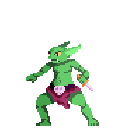
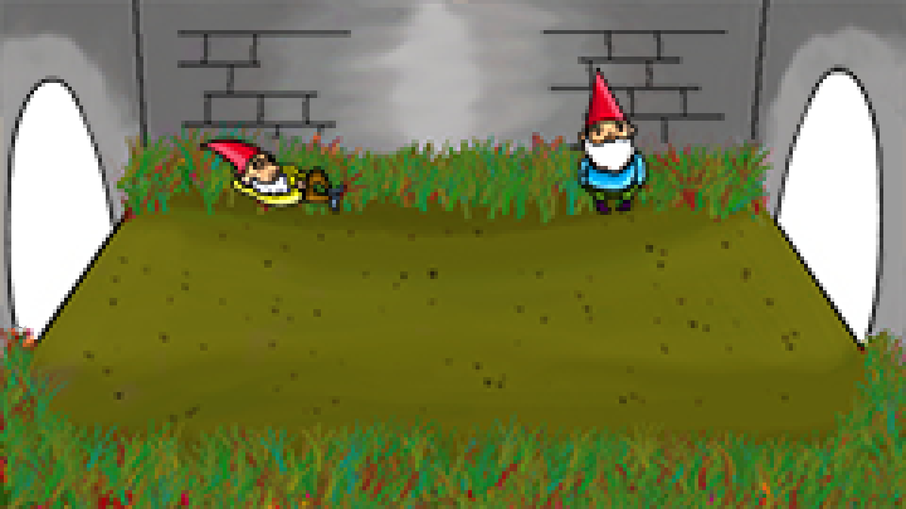
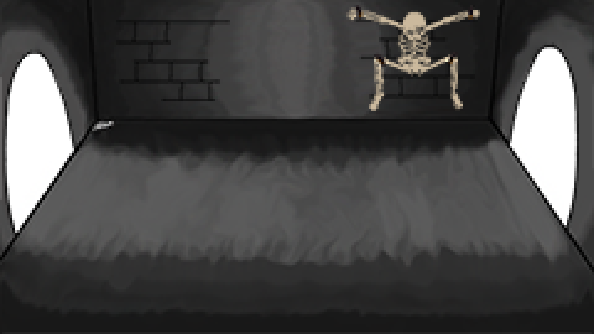
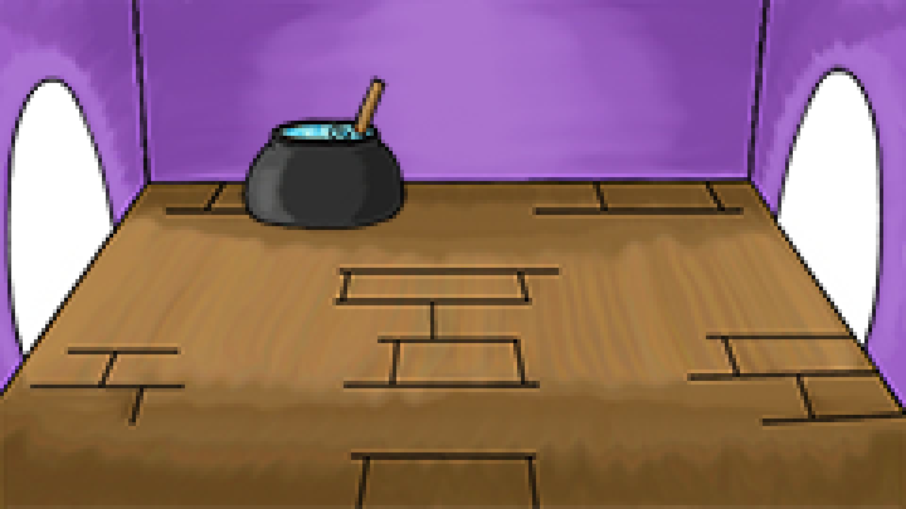

# *Knights & Castles*
Título
: Documento de diseño de juego - *Knights & Castles*

Autores
: Díaz Pérez, Diego
: Laso Cáceres, Juan Carlos
: Mena Molina, Guillermo
: Rodríguez Corpas, Laura
: Rodríguez Martínez, Francisco Javier

[Castle's Games ](https://github.com/CastlesGames/CastlesGames.github.io)
[Castle's Games - GitHub Page](https://castlesgames.github.io/)

## 1. Concepto
   + **Título**:  *Knights & Castles*.
   + **Estudio**: *Castle's Games*.
   + **Género**: Juego de Cartas y Rol de acción por turnos.
   + **Arte**: *Pixel Art*.
   + **Plataforma**: PC y *Smartphone*.
   + **Versión:** 1.0.
   + **Sinopsis de jugabilidad y contenido**: juego de cartas con ambientación fantástica en el que el protagonista deberá avanzar de sala en sala enfrentándose a los distintos enemigos que le aguardan, con el fin de llegar al enfrentamiento final en una emocionante batalla de cartas por turnos.
   + **Categoría**: *Knights & Castles* se puede comparar con el videojuego *Hearthstone*, ya que tiene combates de cartas con las que el jugador puede atacar o defenderse. Las principales diferencias con *Hearthstone* es que en éste únicamente tiene esa mecánica de juego y son combates individuales contra otros jugadores, mientras que en *Knights & Castles* el jugador tiene que ir avanzando a través de varios combates recorriendo niveles y un escenario. Además, en *Knights & Castles* el jugador no crea un mazo de cartas que pueda utilizar en todas las partidas, si no que en cada partida que se empieza, el jugador comienza con unas cartas determinadas (5 cartas) y puede ir ampliando su mano (hasta un total de 7 cartas) durante el transcurso de la partida.
   + **Licencia**: este juego de cartas y rol de acción es totalmente original y no está basado en ningún libro o película. 
   + **Mecánica**: el jugador tendrá la posibilidad de hacer click en las distintas cartas que posea en su mano para utilizarlas durante un combate. También podrá pulsar los botones que aparezcan en los escenarios, éstos le permitirán explorar el escenario e ir avanzando por ellos hasta llegar al final donde se deberá enfrentar al *Final Boss*.
   + **Tecnología**: el juego ha sido desarrollado íntegramente en **HTML5**, **CSS3** y ***JavaScript***.  En cuanto al arte del videojuego, se ha utilizado el programa ***Adobe Photoshop CC 2018*** del paquete *Adobe*.
   + **Público**: el público objetivo está entre el rango de edades de 16 a 30 años. Entre ellos, jugadores que disfruten los juegos de cartas por turnos, la ambientación medieval fantástica y que prefieran partidas rápidas o no tengan demasiado tiempo para dedicar a los videojuegos.

## 2. Historial de versiones
| Versión 	| Fecha 	 | Comentarios|
|:---------:|:----------:|------------|
| 0.0 		| 15/10/2018 | Planteamiento del juego y construcción inicial del Documento de Diseño de Juego (*Game Document Design - G.D.D.*)|
| 0.1		| 16/10/2018 | Se definen *mecánicas*, *arte del juego*, *estructuración de niveles* |
| 0.2 		| 21/10/2018 | Se completa la primera versión del *G.D.D.* de *Knights & Castles* |
| 0.3		| 30/10/2018 | Se completa la mecánica del personaje principal (salud, armadura...) |
| 0.4		| 08/11/2018 | Se completa el sistema de cartas |
| 0.5		| 14/11/2018 | Se completa el sistema de niveles |
| 0.6		| 20/11/2018 | Se completa el sistema de inventario |
| 0.7		| 25/11/2018 | Se completan escenarios y audios del juego |
| 0.8		| 28/11/2018 | Se completa el sistema de combate |
| 0.9		| 03/11/2018 | Se añaden detalles que mejoren la experiencia de juego (feedback visual) |
| 1.0		| 04/12/2018 | Se completa la versión final de *Knights & Castles* |

## 3. Visión general del videojuego
*Knights & Castles* es un juego de cartas y rol de acción por turnos con ambientación medieval donde el jugador toma el control de un caballero que tendrá que ir avanzando a través de las distintas habitaciones de un castillo derrotando a los distintos enemigos que vaya encontrando hasta llegar al enemigo final. Las batallas contra enemigos funcionarán por turnos y se jugarán mediante cartas con las que el jugador podrá atacar, defenderse o realizar hechizos de magia que le ayuden durante el combate.

Cada carta tendrá un coste de maná, y durante cada turno el jugador tendrá un número limitado de puntos de maná con los que tendrá que elegir qué cartas le conviene utilizar en cada momento del combate. Las cartas iniciales tendrán un coste bajo, pero conforme el jugador vaya consiguiendo cartas mejores, éstas tendrán un coste más alto.

El *gameplay* del juego se basa en la progresión, ya que el jugador tiene que ir avanzando a través de los niveles e ir convirtiéndose en un personaje más fuerte para luchar contra los enemigos. Además, el juego crea una sensación de aleatoriedad mediante los distintos diseños que tendrán los escenarios durante la partida y las cartas que el jugador puede ir consiguiendo a través de los niveles, intentando evitar que todas las partidas se sientan igual.

Otra de las ventajas del juego es su duración. Cada partida tendrá un máximo de tres niveles y un enemigo final al que hay que derrotar para ganar, esto permitiría jugar partidas rápidas y facilitaría el juego a las personas que no tienen mucho tiempo libre.

En definitiva, *Knights  & Castles* es un juego rápido, con una duración prácticamente infinita gracias a su rejugabilidad y donde ninguna partida será igual que la anterior.

## 4. Mecánicas
   + **Cámara:** videojuego en 2D. Plano Sagital. El jugador es capaz de ver a todos los personajes que se encuentren en una misma sala, y la propia sala al completo.
   + **Controles:** en PC mediante el ratón y haciendo *click* / En *Smartphone* mediante la pulsación de los diferentes botones que aparezcan en pantalla.
   + **Puntuación:** se obtienen puntos por avanzar a través de las distintas salas y habitaciones e ir derrotando a los enemigos que aparecen en ellas.
   + **Guardar/Cargar:** no se puede ni cargar ni guardar partida. Una vez cierras el juego, se vuelve a empezar desde cero.
   + **Cartas**: se utilizan durante los combates. Hay tres tipos de cartas: *ataque*, *escudo* y *magia*. Cada tipo tiene un propósito distinto y permite al jugador realizar distintas combinaciones.
   + ***Items***: son objetos que se complementan con las cartas y que el jugador podrá llevar para mejorar sus estadísticas base y así mejorar el poder de sus cartas. Pueden ser *armas*, *armaduras* o *amuletos*.
   + **Niveles**: habrá tres niveles por los que el jugador tiene que avanzar hasta llegar al jefe final. Cada nivel tendrá su propia dificultad y sus propios enemigos, *ítems* o cartas que el jugador puede conseguir.

## 5. Estados del juego
A continuación se presenta el diagrama de estados del juego sobre las posibles pantallas de la interfaz en las que el jugador se puede encontrar:

> Diferentes estados del juego

Estos estados se describen más detenidamente en el apartado siguiente - ***6. Interfaces***
## 6. Interfaces
   + **Menú principal**: es la pantalla inicial que se encuentra el jugador al iniciar el juego. El jugador podrá localizar en ella cuatro botones con los que tendrá la opción de abrir el menú de opciones, la pantalla de puntuaciones, la pantalla de créditos/contacto y el que da la opción de iniciar una partida. Estos botones se disponen alineados verticalmente uno encima de otro con una separación entre ellos. No hay *background*, en su defecto se enseña ya la primera sala del juego con el caballero. Los botones desaparecen una vez haces *click* o pulsas en el botón *Play*.
      + Estados del juego: 
	      + Hacia el **menú de opciones** pulsando en el botón *Opciones*.
	      + Hacia la **pantalla de puntuaciones** pulsando en el botón *Puntuaciones*.
	      + Hacia la **pantalla de créditos** pulsando en el botón *Créditos*.
	      + Hacia la **pantalla de juego** pulsando en el botón *Play*.
   + **Menú de opciones**: pantalla en la cual el jugador puede eligir el *idioma* del juego (Castellano o Inglés) y habilitar/deshabilitar la *música y sonido*. La pantalla dispondrá de un botón para volver al *menú principal*.
      + Estados del juego: 
	      + Hacia el **menú principal** pulsando en el botón con una flecha la cual indica *volver a la pantalla anterior*.
   + **Pantalla de créditos / contacto**: pantalla en la cual el jugador puede ver quiénes han sido los desarrolladores y artistas que han participado en la creación del videojuego. Tan sólo consta de la información y un botón de regreso al menú principal.
      + Estados del juego: 
	      + Hacia el **menú principal** pulsando en el botón con una flecha la cual indica *volver a la pantalla anterior*.
   + **Pantalla puntuaciones**: pantalla donde se muestra al jugador las diferentes puntuaciones que ha ido obteniendo en las partidas que ha jugado. Tan sólo consta de la información y un botón de regreso al menú principal.
      + Estados del juego: 
	      + Hacia el **menú principal** pulsando en el botón con una flecha la cual indica *volver a la pantalla anterior*.
   + **Pantallas de juego /** ***Heads-up Display***: pantalla que muestra toda la información necesaria al jugador durante la partida. Se distribuyen de la siguiente manera:
	   + PC: 
		   + Los objetos que el jugador equipe a su personaje se mostrarán con tres iconos (armadura, arma, amuleto) abajo de la pantalla a la izquierda.
		   + Los botones de avanzar a la siguiente pantalla se representarán mediante flechas.
		   + La salud del jugador y su armadura se colocarán en la esquina superior izquierda de la pantalla.
		   + Las cartas de las que disponga el jugador, se verán centradas en la zona de abajo de la pantalla. Sólo se podrá interactuar con las cartas durante un combate, fuera de él estarán deshabilitadas y el jugador sólo podrá leer la información que se le proporciona.
		   + En la esquina superior derecha se le mostrará un botón de pausa al jugador para que pueda pausar la partida en cualquier momento. Esta acción también podrá llevarse a cabo pulsando la tecla *p* en el teclado.
	   + *Smartphone*:
		   + Los objetos que el jugador equipe a su personaje se mostrarán con tres iconos (armadura, arma, amuleto) a la izquierda de la pantalla en forma de columna.
		   + Los botones de avanzar a la siguiente pantalla se representarán mediante flechas. Según la zona donde se encuentre y la que quiera avanzar, estos botones estarán colocados arriba, derecha o izquierda de la pantalla.
		   + La salud del jugador y su armadura se colocarán en la esquina superior izquierda de la pantalla.
		   + Las cartas de las que disponga el jugador, se verán centradas en la zona de abajo de la pantalla. Sólo se podrá interactuar con las cartas durante un combate, fuera de él estarán deshabilitadas y el jugador sólo podrá leer la información que se le proporciona.
		   + En la esquina superior derecha se le mostrará un botón de pausa al jugador para que pueda pausar la partida en cualquier momento.
	   + Estados del juego:
		   +  Hacia el **menú de pausa** pulsando sobre el botón de pausa situado en la esquina superior derecha.
   + **Pantalla de pausa**: pantalla donde el jugador puede parar el estado de la partida, durante el tiempo que quiera. Esta pantalla dispondrá de dos botones para volver al menú principal o bien reanudar la partida. Estos botones se encuentran centrados en pantalla y alineados verticalmente uno del otro. 
      + Estados del juego: 
	      + Hacia el **menú principal** pulsando en el botón *Menú principal*.
	      + Hacia la **pantalla de juego** pulsando en el botón *Volver al juego*.
   + **Pantalla fin del juego / puntuación**: pantalla donde se le muestra la puntuación obtenida al finalizar el juego. Consta de la información y un sólo botón para volver al menú principal, ya sea para comenzar una partida nueva o salir del juego.
      + Estados del juego:
	      + Hacia el **menú principal** pulsando en el botón *Menú principal*.
      
## 7. Niveles
El juego consta de **tres niveles** en los cuales la dificultad de los enemigos irá aumentando para el jugador. 

Cada nivel consta de **cinco salas** y la estructura de cada nivel será de una primera sala fija, tres salas aleatorias y la sala final con el *Enemy Boss* correspondiente a ese nivel. ***El jugador no podrá volver hacia una sala anterior o nivel anterior en ningún momento***.

En las tres salas aleatorias el jugador se podrá encontrar diferentes sucesos los cuales aparecerán de forma totalmente aleatoria en cada partida. :
+ Un **enemigo**: da lugar a un combate.
+ Un **cofre**: el jugador puede obtener nuevas cartas o *items* con los que equiparse.
+ Un **evento aleatorio**:
+ Una **enfermería**: el jugador recupera sus puntos de vida perdidos en combates anteriores.  

El jugador deberá atravesar todas las salas para avanzar al siguiente nivel. Una vez el jugador derrote al enemigo final del nivel podrá avanzar al siguiente nivel de la partida.

A continuación se describe con más detalle los tres niveles del juego:

+ ***Nivel 1*** **- Entrada**
	+ **Entrada**:  primer nivel del juego y el más sencillo. Este nivel consta de cinco salas. La 1ª Sala será un combate contra un enemigo básico, que nos servirá también como tutorial para aprender las mecánicas básicas del juego. Luego encontraremos tres salas más donde se darán los diferentes sucesos descritos anteriormente. Por último, una sala final con el *Enemy Boss* de este nivel. Una vez derrotado se abrirá la opción de elegir entre **tres caminos** para avanzar.
		+ *Objetivos*: el jugador deberá atravesar todas las salas para avanzar al siguiente nivel. Una vez el jugador derrote al enemigo final del nivel podrá avanzar al siguiente nivel de la partida.
		+ *Enemigos*: Goblin, HomoGoblin.
		+ *Música y efectos de sonido*: 
 + ***Nivel 2*** **- Torreón / Jardines / Mazmorras**
	 + **Torreón**: segundo nivel del juego con una dificultad intermedia. Este nivel consta de cinco salas. La 1ª Sala será una sala con cofre para recompensar al jugador por haber derrotado al *Enemy Boss* del nivel anterior. En esta sala también nos curaremos la vida por completo. Luego encontraremos tres salas más donde se darán los diferentes sucesos descritos anteriormente. Por último, una sala final con el *Enemy Boss* de este nivel. Una vez derrotado podremos avanzar hacia la **Torre de Magia**.
		+ *Objetivos*: el jugador deberá atravesar todas las salas para avanzar al siguiente nivel. Una vez el jugador derrote al enemigo final del nivel podrá avanzar al siguiente nivel de la partida.
		+ *Enemigos*: Aprendiz de mago, Mago corrupto.
		+ *Música y efectos de sonido*: 
	 + **Jardines**: segundo nivel del juego con una dificultad intermedia. Este nivel consta de cinco salas. La 1ª Sala será una sala con cofre para recompensar al jugador por haber derrotado al *Enemy Boss* del nivel anterior. En esta sala también nos curaremos la vida por completo. Luego encontraremos tres salas más donde se darán los diferentes sucesos descritos anteriormente. Por último, una sala final con el *Enemy Boss* de este nivel. Una vez derrotado podremos avanzar hacia el **Salón de fiestas**.
		+ *Objetivos*: el jugador deberá atravesar todas las salas para avanzar al siguiente nivel. Una vez el jugador derrote al enemigo final del nivel podrá avanzar al siguiente nivel de la partida.
		+ *Enemigos*: Aprendiz de mago, Mago corrupto.
		+ *Música y efectos de sonido*: 
	 + **Mazmorras**: segundo nivel del juego con una dificultad intermedia. Este nivel consta de cinco salas. La 1ª Sala será una sala con cofre para recompensar al jugador por haber derrotado al *Enemy Boss* del nivel anterior. En esta sala también nos curaremos la vida por completo. Luego encontraremos tres salas más donde se darán los diferentes sucesos descritos anteriormente. Por último, una sala final con el *Enemy Boss* de este nivel. Una vez derrotado podremos avanzar hacia los **Aposentos de los guardias**.
		+ *Objetivos*: el jugador deberá atravesar todas las salas para avanzar al siguiente nivel. Una vez el jugador derrote al enemigo final del nivel podrá avanzar al siguiente nivel de la partida.
		+ *Enemigos*: Aprendiz de mago, Mago corrupto.
		+ *Música y efectos de sonido*: 
  + ***Nivel 3*** **- Torre de magia / Salón de fiestas / Aposentos de los guardias / Sala del Trono**
	 + **Torre de magia**: tercer nivel del juego con una dificultad alta. Este nivel consta de cinco salas. La 1ª Sala será una sala con cofre para recompensar al jugador por haber derrotado al *Enemy Boss* del nivel anterior. En esta sala también nos curaremos la vida por completo. Luego encontraremos tres salas más donde se darán los diferentes sucesos descritos anteriormente. Al superar la cuarta sala, accederemos a la **Sala del Trono** para enfrentarnos al *Boss* final del juego.
		+ *Objetivos*: el jugador deberá completar todas las salas del nivel.
		+ *Enemigos*: Caballero oscuro.
		+ *Música y efectos de sonido*: 
	 + **Salón de fiestas**: tercer nivel del juego con una dificultad alta. Este nivel consta de cinco salas. La 1ª Sala será una sala con cofre para recompensar al jugador por haber derrotado al *Enemy Boss* del nivel anterior. En esta sala también nos curaremos la vida por completo. Luego encontraremos tres salas más donde se darán los diferentes sucesos descritos anteriormente. Al superar la cuarta sala, accederemos a la **Sala del Trono** para enfrentarnos al *Boss* final del juego.
		+ *Objetivos*: el jugador deberá completar todas las salas del nivel.
		+ *Enemigos*: Caballero oscuro.
		+ *Música y efectos de sonido*: 
	 + **Aposentos de los guardias**: tercer nivel del juego con una dificultad alta. Este nivel consta de cinco salas. La 1ª Sala será una sala con cofre para recompensar al jugador por haber derrotado al *Enemy Boss* del nivel anterior. En esta sala también nos curaremos la vida por completo. Luego encontraremos tres salas más donde se darán los diferentes sucesos descritos anteriormente.
		+ *Objetivos*: el jugador deberá completar todas las salas del nivel.
		+ *Enemigos*: Caballero oscuro.
		+ *Música y efectos de sonido*: 
## 8. Progreso del juego
En la siguiente ilustración se muestra el diagrama de progreso de juego:

> Diagrama progreso de juego

## 9. Personaje/s
   - **Personaje principal**:
	  + *Nombre*: Geralt.
      + *Descripción*: caballero misterioso del que se desconocen sus orígenes o sus intenciones.
      + *Concepto*: el personaje será un varón adulto. Su vestimenta constara de una armadura vieja y
un yelmo. También portará una espada.
      + *Encuentro*: el jugador se encontrará con este personaje cuando de inicio una nueva partida, en la primera sala.
      + *Características*: vida máxima, armadura, ataque, defensa, cantidad de maná, poder mágico.
      + *Items*: tiene espacio para tres *items*: un arma, una armadura y un amuleto. Comenzará cada
partida sin ítems y podrá ir intercambiándolos con los que consiga a lo largo de la partida.
      + *Jugable/No-Jugable*: jugable.
 
## 10. Enemigos
A continuación se da una breve descripción de los personajes que sirven de enemigo para el jugador en el juego. Se clasifican según el nivel en el que vayan apareciendo dichos personajes:
   - **Enemigos nivel 1**
      + *Nombre*: **Goblin**.
      + *Descripción*: pequeños monstruos que habitan por todo el castillo. Son unos monstruos débiles pero te pondrán en un aprieto si no los eliminas rápidamente.
      + *Encuentro*: podemos encontrarlos en los niveles 1 y 2.
      + *Imagen*:
      
      + *Habilidades*: 
	      + *Ataque con daga*: el goblin se abalanza contra el jugador inflingiendo 15 de daño base al personaje.
      + *Items*: el enemigo soltará una carta aleatoria una vez lo derrotemos.
   - **Jefe final nivel 1**
      + *Nombre*: **HomoGoblin**.
      + *Descripción*: goblin de gran tamaño y mucho más poderoso que sus primes, los goblins. Este monstruo cuenta con un poderosa fuerza física y puede ponerse frenético si sufre muchos daños.
      + *Encuentro*: es el *Enemy Boss* del nivel 1.
      + *Imagen*:
      
      + *Habilidades*: 
	      + *Ataque con porra*: el homogoblin se abalanza contra el jugador inflingiendo 25 de daño base al personaje.
	      + *Frenesí*: cuando le queda menos de un tercio de vida, aumenta su daño en 5 puntos. 
      + *Items*: el enemigo soltará una carta o *item* aleatorio una vez lo derrotemos.
   - **Enemigos nivel 2**
      + *Nombre*: **Aprendiz de mago**.
      + *Descripción*: estos magos sin graduar conocen hechizos de bajo nivel, pero en ocasiones podrán sorprender al jugador con un hechizo poderoso que acaban de aprender.
      + *Encuentro*: podemos encontrarlos en los niveles 2 y 3.
      + *Imagen*:
      
      + *Habilidades*: 
	      + *Hechizo de fuego*: hechizo de bajo nivel que prenderá al jugador en llamas infringiendo 20 puntos de daño base al jugador.
	      + *Gran bola de fuego*: enorma bola de fuego que causará 40 de daño base. La probabilidad de que el un aprendiz de mago realice este hechizo es muy baja.
      + *Items*: el enemigo soltará una carta aleatoria una vez lo derrotemos.
   - **Jefe final nivel 2**
      + *Nombre*: **Mago corrupto**.
      + *Descripción*: poderoso mago seguidor del culto de la magia oscura que conoce gran cantidad de hechizos prohibidos muy poderosos.
      + *Encuentro*: es el *Enemy Boss* del nivel 1.
      + *Imagen*:
      
      + *Habilidades*: 
	      + *Bola de fuego*: hechizo de fuego que infringe 30 puntos de daño base al jugador.
	      + *Hielo corrupto*: hechizo de congelará al jugador y que infringe 20 puntos de daño base al jugador y reduce su defensa.
      + *Items*: el enemigo soltará una carta o *item* aleatorio una vez lo derrotemos.
   - **Enemigos nivel 3**
      + *Nombre*: **Caballero oscuro**.
      + *Descripción*: caballero que ha traicionado sus votos sagrados y acabará con cualquiera que se cruce en su camino.
      + *Encuentro*: podemos encontrarlos en el nivel 3.
      + *Imagen*:
      
      + *Habilidades*: 
	      + *Espadazo*: golpe con una enorme espada que infringe 30 puntos de daño base al jugador. 
      + *Items*: el enemigo soltará una carta aleatoria una vez lo derrotemos.
   - **Jefe final del juego**
      + *Nombre*: **Rey maldito**.
      + *Descripción*: gobernante del castillo, se volvió demente al morir su hija y ahora gobierna un reino sumido en la miseria y la locura.
      + *Encuentro*: es el *Final Boss* del juego.
      + *Imagen*:
      
      + *Habilidades*: 
	      + *Golpe de cetro*: golpetazo con su bastón que infringe 30 puntos de daño base al jugador.
	      + *Golpe con espada*: espadazo que infringe 40 puntos de daño base al jugador. 
      + *Items*: el enemigo no soltará ninguna carta o *item* al jugador.
    
## Habilidades
El jugador dispondrá de una cantidad de **cartas** en la mano, las cuales podrá usar en los distintos combates contra los enemigos del castillo. El uso de las distintas cartas que posea el jugador durante un turno del combate se verá limitado por un **indicador de *maná***. Este indicador tiene, inicialmente, un máximo de *3 cupos* de *maná*, aunque puede incrementarse por algunos objetos que tenga el jugador de inventario.

Inicialmente, el jugador comienza el juego con un total de **5 cartas** y podrá tener un total de **7 cartas** en su mano. Si la mano del jugador está **completa** no se podrán añadir más cartas a su mano. En cambio, deberá deshacerse de una que ya tenga para obtener una nueva.
La forma de conseguir cartas son las siguientes:
+ Los enemigos o jefes finales a los que derrotes pueden *dropear* una carta.
+ Se pueden encontrar cartas en los distintos cofres repartidos por el juego.

Se pueden clasificar las cartas en tres **tipos**: *Ataque, Escudo y Magia*. 
1. ***Ataque***: cartas que utiliza el jugador para dañar a los enemigos y quitarles puntos de vida. 
    + **Espadazo**: ataque básico que consiste en un golpe de espada.
      + *Coste de maná*: 1
      + *Daño base*: 10
      + *Aumento armadura*: 0
      + *Curación*: 0
    + **Mazazo**: ataque fuerte a dos manos con una maza. 
      + *Coste de maná*: 2
      + *Daño base*: 25
      + *Aumento armadura*: 0
      + *Curación*: 0
    + **Golpe de escudo**: ataque cargado con el escudo.
      + *Coste de maná*: 1
      + *Daño base*: 15
      + *Aumento armadura*: 20
      + *Curación*: 0
    + **Flechazo**: ataque con el arco que inflige un *bufo* negativo al enemigo durante 3 turnos. Efecto no acumulables hasta no haber pasado los 3 turnos.
      + *Coste de maná*: 1
      + *Daño base*: 15
      + *Aumento armadura*: 0
      + *Curación*: 0
    + **Destello**: ciegas al enemigo evitando que pueda golpearte en el siguiente turno. 
      + *Coste de maná*: 2
      + *Daño base*: 10
      + *Aumento armadura*: 50
      + *Curación*: 0
2. ***Escudo***: cartas que utiliza el jugador para aumentar la defensa durante el combate contra un enemigo.
    + **Incremento de armadura**: Incremento de armadura.
      + *Coste de maná*: 1
      + *Daño base*: 0
      + *Aumento armadura*: 25
      + *Curación*: 0
    + **Incremento de armadura II**: Incremento de armadura avanzado.
      + *Coste de maná*: 2
      + *Daño base*: 0
      + *Aumento armadura*: 50
      + *Curación*: 0
    + **Fortificación**: Incrementa tu armadura en ese turno y aumenta la defensa durante el resto del combate
      + *Coste de maná*: 3
      + *Daño base*: 0
      + *Aumento armadura*: 70
      + *Curación*: 0
3. ***Magia***: cartas con habilidades especiales que se pueden utilizar tanto para atacar como para defenderse y/o curarse durante el combate.
   + **Bola de fuego**: lanza un bola de fuego al enemigo.
      + *Coste de maná*: 2
      + *Daño base*: 30
      + *Aumento armadura*: 0
      + *Curación*: 0
   + **Curar**: habilidad mágica que hace recuperar 15 puntos de vida al jugador.
      + *Coste de maná*: 1
      + *Daño base*: 0
      + *Aumento armadura*: 0
      + *Curación*: 25
   + **Curar II**: habilidad mágica que hace recuperar 25 puntos de vida al jugador.
      + *Coste de maná*: 2
      + *Daño base*: 0
      + *Aumento armadura*: 0
      + *Curación*: 50

## Inventario
El jugador consta con un **inventario** donde puede añadir los objetos o *items* que consiga a lo largo del juego. El inventario se divide en 3 **tipos** de objetos que puede asignar el jugador a su personaje. Estos tipos son:
+ ***Armadura*** del personaje: *items* con los que modificar las características de *cantidad armadura*, *aumento de defensa* o aumentar la cantidad de *vida máxima*.
+ ***Arma*** del personaje: *items* con los que modificar la característica del jugador *aumento de ataque*.
+ ***Amuleto*** del personaje: *items* con los que se pueden aumentar cualquier característica del jugador, según el *item* que lleve equipado el personaje.

Descripción de los distintos ***items*** que podrá conseguir el jugador a lo largo del juego para modificar las estadísticas base del jugador descritas anteriormente (vida máxima, cantidad armadura, aumento de ataque, aumento de defensa, aumento del poder mágico, cantidad de *maná*).

A lo largo del juego se pueden encontrar *items* 

1. ***Armaduras***
   + **Armadura de cuero**:
	   + *Vida máxima*: 100 (base) + **10**
	   + *Ataque*: 0 (base) + *0*
	   + *Defensa*: 0 (base) + **1**
	   + *Poder mágico*: 0 (base) + *0*
	   + *Cantidad de maná*: 3 (base) + *0*
   + **Armadura de metal**:
	   + *Vida máxima*: 100 (base) + *15*
	   + *Ataque*: 0 (base) + *0*
	   + *Defensa*: 0 (base) + **2**
	   + *Poder mágico*: 0 (base) + *0*
	   + *Cantidad de maná*: 3 (base) + *0*
   + **Armadura de oro**:
	   + *Vida máxima*: 100 (base) + **20**
	   + *Ataque*: 0 (base) + *0*
	   + *Defensa*: 0 (base) + **3**
	   + *Poder mágico*: 0 (base) + *0*
	   + *Cantidad de maná*: 3 (base) + *0*
   + **Armadura legendaria**: 
	   + *Vida máxima*: 100 (base) + **50**
	   + *Ataque*: 0 (base) + *0*
	   + *Defensa*: 0 (base) + **5**
	   + *Poder mágico*: 0 (base) + *0*
	   + *Cantidad de maná*: 3 (base) + *0*
2. ***Armas***
   + **Espada rota**: 
	   + *Vida máxima*: 100 (base) + *0*
	   + *Ataque*: 0 (base) + **1**
	   + *Defensa*: 0 (base) + *0*
	   + *Poder mágico*: 0 (base) + *0*
	   + *Cantidad de maná*: 3 (base) + *0*
   + **Espada**:
	   + *Vida máxima*: 100 (base) + *0*
	   + *Ataque*: 0 (base) + **2**
	   + *Defensa*: 0 (base) + *0*
	   + *Poder mágico*: 0 (base) + *0*
	   + *Cantidad de maná*: 3 (base) + *0*
   + **Hacha de combate**:
	   + *Vida máxima*: 100 (base) + *0*
	   + *Ataque*: 0 (base) + **3**
	   + *Defensa*: 0 (base) + *0*
	   + *Poder mágico*: 0 (base) + *0*
	   + *Cantidad de maná*: 3 (base) + *0*
   + ***Excalibur***:
	   + *Vida máxima*: 100 (base) + *0*
	   + *Ataque*: 0 (base) + **5**
	   + *Defensa*: 0 (base) + *0*
	   + *Poder mágico*: 0 (base) + *0*
	   + *Cantidad de maná*: 3 (base) + *0*
3. ***Amuletos***
   + **Colgante de rubí**:
	   + *Vida máxima*: 100 (base) + *0*
	   + *Ataque*: 0 (base) + *0*
	   + *Defensa*: 0 (base) + *0*
	   + *Poder mágico*: 0 (base) + **2**
	   + *Cantidad de maná*: 3 (base) + *0*
   + **Anillo de zafiro**: 
	   + *Vida máxima*: 100 (base) + *0*
	   + *Ataque*: 0 (base) + *0*
	   + *Defensa*: 0 (base) + *0*
	   + *Poder mágico*: 0 (base) + *0*
	   + *Cantidad de maná*: 3 (base) + **1**
   + **Moneda del Rey**:
	   + *Vida máxima*: 100 (base) + **5**
	   + *Ataque*: 0 (base) + **2**
	   + *Defensa*: 0 (base) + **2**
	   + *Poder mágico*: 0 (base) + **0**
	   + *Cantidad de maná*: 3 (base) + **1**
   + **Corona del Rey**: 
	   + *Vida máxima*: 100 (base) + **20**
	   + *Ataque*: 0 (base) + **1**
	   + *Defensa*: 0 (base) + **1**
	   + *Poder mágico*: 0 (base) + **1**
	   + *Cantidad de maná*: 3 (base) + **2**
	   
## Música y sonidos
Para la música del juego se he buscado usar melodías que concuerden con la temática medieval del juego. El audio utilizado en *Knights & Castles* se ha obtenido de un repositorio de muestras de audio. Algunas de estas muestras cuentan con una licencia *CC0 1.0* de dominio público, mientras que otras cuentan con una licencia *CC BY 3.0* de atribución. Los autores de estas muestras son:

*Moan Male Beat Punch by Dersuperanton (freesound.org)
Zombie Roar by Gneube (freesound.org)
Misterious Magic by Eric Matyas (soundimage.org)
Button by Distillerystudio (freesound.org)
Heartbeat by Jobro (freesound.org)
Boss Battle Loop 2 by TeknoAXE (teknoaxe.com)*

## Imágenes de concepto
A continuación se muestran algunos primeros *concepts* sobre algunos escenarios del juego. 

+ Zona de los **Jardines**

> *Concept art*: Escenario 1 - Jardín

+ Zona del **Torreón**

> *Concept art*: Escenario 1 - Torreón

> *Concept art*: Escenario 2 - Torreón

> *Concept art*: Escenario 3 - Torreón

+ Zona de las **Mazmorras**

> *Concept art*: Escenario - Mazmorras

+ Zona de la **Torre de Magia**

> *Concept art*: Escenario 1 - Torre de magia

> *Concept art*: Escenario 2 - Torre de magia

> *Concept art*: Escenario 3 - Torre de magia

+ **Pasillos**

> *Concept art*: Escenario 1 - Pasillos

Y las siguientes son imágenes de los escenarios finales realizados a partir de estos *concepts* utilizados en el juego:

+ Zona de los **Jardines**

+ Zona del **Torreón**

+ Zona de las **Mazmorras**

+ Zona de la **Torre de Magia**

## Manual de juego
El usuario podrá jugar tanto en un PC como en un *Smartphone*.

La interacción con los diferentes elementos del videojuego (utilización de las cartas, botones de avance de escena, apertura de cofres, navegación por el menú...) será mediante la pulsación (*smartphone*) o haciendo *click* con el ratón en dichos elementos.

Tan sólo será necesario disponer de un teclado (para la introducción del nombre del jugador al final de la partida) y ratón en PC.

Para avanzar al siguiente escenario, deberás derrotar como mínimo a 2 enemigos y un boss final. La dificultad de los enemigos según avanzas al siguiente escenario en el juego, irá aumentando.

Si el jugador elige la dificultad difícil, los personajes enemigos dispondrán del doble de vida y aumentarán su poder de ataque en 25 puntos de daño, mientras que el jugador dispondrá de las mismas cartas de inicio con el mismo poder de ataque y mismos objetos iniciales en el inventario.

En caso de que el jugador sea derrotado o bien decida abandonar la partida en desarrollo, iniciará una nueva partida desde el inicio del juego ya que esta versión no dispone de puntos de guardado para guardar el progreso de la partida.

## Miembros del equipo
1. Game designer: ***Laura Rodríguez***
2. Programadores: ***Diego Díaz*** & ***Francisco Javier Rodríguez***
3. Artistas 2D: ***Juan Carlos Laso***, ***Guillermo Mena*** & ***Laura Rodríguez***
4. Maquetadores web: ***Francisco Javier Rodríguez***

## Detalles de produccion
Fecha de inicio del videojuego: ***15 octubre 2018***
Fecha de terminación del videojuego: ***04 diciembre 2018***

