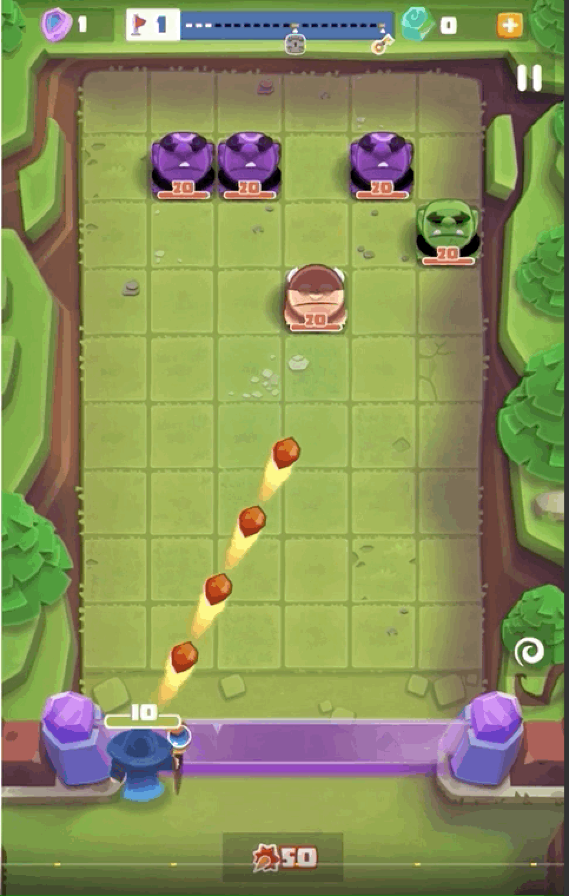
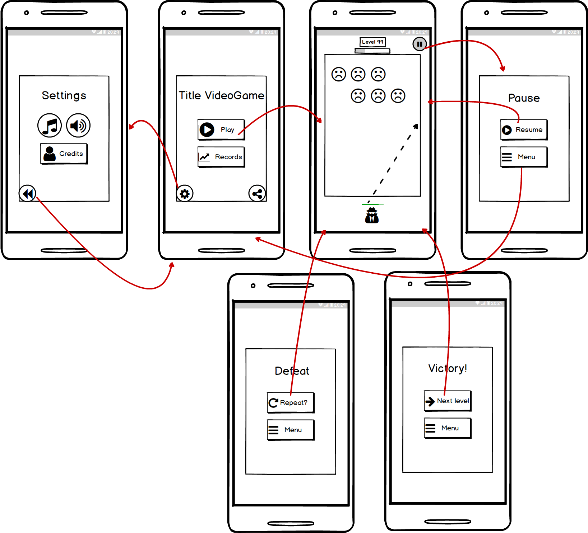

# *Wanted: Point and Shot (provisional)*
Título
: Documento de diseño de juego - *Wanted: Point and Shot (provisional)*

Autores
: Díaz Pérez, Diego
: Laso Cáceres, Juan Carlos
: Mena Molina, Guillermo
: Rodríguez Corpas, Laura
: Rodríguez Martínez, Francisco Javier

## 1. Concepto
   + **Título**:  *Wanted: Point and Shot*.
   + **Estudio**: *Castle's Games*.
   + **Género**: Arcade.
   + **Arte**: 3D con estilo *cartoon*.
   + **Plataforma**: Smartphone y PC (Web Version)*.
   + **Versión:** 1.0.
   + **Sinopsis de jugabilidad y contenido**: *Wanted: Point and Shot* es un juego arcade basado en progresión de niveles con una ambientación western donde el protagonista tiene que derrotar a los enemigos disparando su arma.
   + **Categoría**: *Wanted: Point and Shot* se puede comparar con el videojuego *Bounzy*, ya que tiene las mismas mecánicas. El valor diferenciador del juego es la temática Western. 
   + **Licencia**: *Wanted: Point and Shot* es totalmente original y no está basado en ningún libro o película. 
   + **Mecánica**: El protagonista utiliza su arma para disparar balas que rebotarán entre los enemigos mediante un sistema de físicas. Cada vez que una bala toque a un enemigo éste perderá un porcentaje de salud.
   + **Tecnología**: El juego será desarrollado íntegramente en **Unity**.  En cuanto al arte del videojuego, se utilizará el programa ***Adobe Photoshop CC 2018*** del paquete *Adobe*. Para el modelado en 3D se utilizarán ***Maya*** y ***3DS Max***.
   + **Público**: El público objetivo está entre el rango de edades de 16 a 30 años. Entre ellos, jugadores masculinos que disfruten la ambientación western y prefieran partidas rápidas o no tengan demasiado tiempo para dedicarle al juego.

## 2. Historial de versiones
| Versión 	| Fecha 	 | Comentarios|
|:---------:|:----------:|------------|
| 0.0 		| 19/11/2018 | Planteamiento del juego y construcción inicial del Documento de Diseño de Juego (*Game Document Design - G.D.D.*)|
| 0.1		| 30/11/2018 | Se definen *mecánicas*, *arte del juego*, *estructuración de niveles* |
| 1.0 		| 05/12/2018 | Se completa la primera versión del *G.D.D.* de *Wanted: Point and Shot*|

## 3. Visión general del videojuego
*Wanted: Point and Shot* es un videojuego de género Arcade Free to Play en el que combina la fase de acción de Bounzy y una temática Western *low poly*, novedosa para este género. 

El jugador encarna al *Sherif* del condado cuya misión es acabar con la delincuencia, en cada nivel el jugador se encontrará con distintos enemigos y un boss final. El juego se basa en una progresión de niveles procedural en los que se aumenta la dificultad.

La fase de acción se basa en un sistema de turnos y una mecánica de disparo, en la que el jugador apunta hacia una parte de la pantalla y dispara una serie de elementos (balas) que rebotan en el escenario a través de un sistema de físicas, estos elementos infringen daño a los enemigos del tablero y dichos enemigos caen una posición en el tablero cada turno, cuando llegan al personaje del jugador le infringen daño.

 - Fase de acción - Wanted: Point and Shot
 

## 4. Mecánicas
   + **Cámara:** Videojuego en 3D con una cámara estática. Plano *top-down*. El jugador puede ver en todo momento todos los elementos del nivel.
   + **Controles:** En PC el jugador apunta moviendo el cursor del ratón y dispara haciendo *clic*. En *Smartphone* se apunta manteniendo el dedo pulsado en la dirección hacia la que quieres disparar y disparas levantando el dedo de la pantalla.
   + **Puntuación:** La puntuación final que haya obtenido el jugador es el número de nivel al que haya llegado.
   + **Guardar/Cargar:** El progreso del jugador se guardará automáticamente. Al iniciar el juego seguirás en el nivel en el que acabaras la última vez.
   + **Niveles**: El número de niveles será infinito y se generarán de forma procedural, el jugador puede avanzar niveles continuamente. Cada nivel se divide en un número de enemigos y un boss final.

## 5. Estados del juego
A continuación se presenta el diagrama de estados del juego sobre las posibles pantallas de la interfaz en las que el jugador se puede encontrar:

> Diferentes estados del juego

Estos estados se describen más detenidamente en el apartado siguiente - ***6. Interfaces***

## 6. Interfaces
   + **Menú principal**: Es la pantalla inicial que se encuentra el jugador al iniciar el juego. El jugador podrá localizar en ella dos botones con los que tendrá la opción de abrir el menú de opciones y de iniciar una partida. Estos botones se disponen alineados verticalmente uno encima de otro con una separación entre ellos. No hay *background*, en su defecto se enseña el propio escenario en el que se jugará la partida.
      + Estados del juego: 
	      + Hacia el **menú de opciones** pulsando en el botón *Opciones*.
	      + Hacia la **pantalla de juego** pulsando en el botón *Play*.
   + **Menú de opciones**: Pantalla en la cual el jugador puede eligir el *idioma* del juego (Castellano o Inglés) y habilitar/deshabilitar la *música y sonido*. Además, en esta pantalla se podrán ver los créditos del juego. La pantalla dispondrá de un botón para volver al *menú principal*.
      + Estados del juego: 
	      + Hacia el **menú principal** pulsando en el botón con una flecha la cual indica *volver a la pantalla anterior*.
   + **Pantallas de juego /** ***Heads-up Display***: pantalla que muestra toda la información necesaria al jugador durante la partida. Se distribuyen de la siguiente manera:
	   + PC: 
			+ El jugador siempre aparecerá en la parte inferior de la pantalla, dejando el resto de la pantalla para ver a los enemigos.
		   + La barra de vida del jugador se colocará en la esquina inferior izquierda de la pantalla y en color verde.
		   + El número de nivel en el que se encuentra el jugador aparecerá en la esquina superior izquierda.
		   + En la esquina superior derecha se le mostrará un botón de pausa al jugador para que pueda pausar la partida en cualquier momento. Esta acción también podrá llevarse a cabo pulsando la tecla *p* en el teclado en el caso de *PC*.
	   + Estados del juego:
		   +  Hacia el **menú de pausa** pulsando sobre el botón de pausa situado en la esquina superior derecha.
   + **Pantalla de pausa**: Pantalla donde el jugador puede parar el estado de la partida, durante el tiempo que quiera. Esta pantalla dispondrá de dos botones para volver al menú principal o bien reanudar la partida. Estos botones se encuentran centrados en pantalla y alineados verticalmente uno del otro. 
      + Estados del juego: 
	      + Hacia el **menú principal** pulsando en el botón *Menú principal*.
	      + Hacia la **pantalla de juego** pulsando en el botón *Volver al juego*.
   + **Pantalla fin del juego / puntuación**: Pantalla donde se le muestra la puntuación obtenida al finalizar el juego. Consta de la información y un sólo botón para volver al menú principal, ya sea para comenzar una partida nueva o salir del juego.
      + Estados del juego:
	      + Hacia el **menú principal** pulsando en el botón *Menú principal*.
      
## 7. Niveles
Los niveles se completarán al derrotar a todos los enemigos. Cada nivel, consta de 10 a 20 oleadas de enemigos. Al final de cada turno al que le toque disparar al jugador, se creará una nueva oleada de enemigos en el grid y los enemigos que ya estén y no hayan sido derrotados, bajarán una posición en el grid del escenario, acercándose cada vez más al jugador.

***Explayarse más en este punto***

## 8. Progreso del juego
En la siguiente ilustración se muestra el diagrama de progreso de juego:

> Diagrama progreso de juego

## 9. Personaje/s
   - **Personaje principal**:
	  + *Nombre*: **Pat Garrett**
      + *Descripción*: Es el sheriff encargado de eliminar a los bandidos.
      + *Concepto*: El personaje será un varón adulto. Su vestimenta tendrá estilo cowboy.
      + *Encuentro*: El jugador se encontrará con este personaje al iniciar cada partida, y jugará siempre con él.
      + *Características*: El personaje solo tendrá una salud máxima.
      + *Jugable/No-Jugable*: Jugable.
 
## 10. Enemigos
A continuación se da una breve descripción de los personajes que sirven de enemigo para el jugador en el juego:
   - **Enemigo Verde**
      + *Nombre*: **Captus matón**.
      + *Descripción*: Enemigos de color verde, son los más débiles del juego
      + *Imagen*:
      + *Salud*: 500.
      + *Ataque*: 1.
   - **Enemigo Azul**
      + *Nombre*: **Indio enrabietado**.
      + *Descripción*: Enemigos marcados de color azul, son más difíciles de derrotar que los enemigos de color verde, ya que ven aumentada su salud y su daño de ataque.
      + *Imagen*:
      + *Salud*: 1500.
      + *Ataque*: 3.
   - **Enemigo rojo**
	   + *Nombre*: **Forajido**.
	   + *Descripción*: Enemigos marcados de color rojo, son los que presentarán más problemas al jugador ya que serán los más resistentes a la hora de destruirlos.
	   + *Imagen*:
	   + *Salud*: 3000
	   + *Ataque*: 4
	- **Boss**:
		 + *Nombre*: **Billy el Niño**.
		 + *Descripción*: Si consigue avanzar hasta la posición del jugador, se acaba la partida, y deberá comenzar de nuevo el nivel. Es muy resistente, y ocupa 4 casillas del grid.
		 + *Imagen*:
		 + *Salud*: 5000
		 + *Ataque*: Toda la vida del jugador.
    
## Música y sonidos

## Imágenes de concepto
A continuación se muestran algunos primeros *concepts* del juego.

+ **Pantalla de juego**

## Miembros del equipo
1. Game designer
2. Programadores
3. Artistas 3D y 2D

